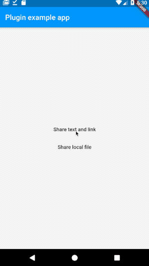
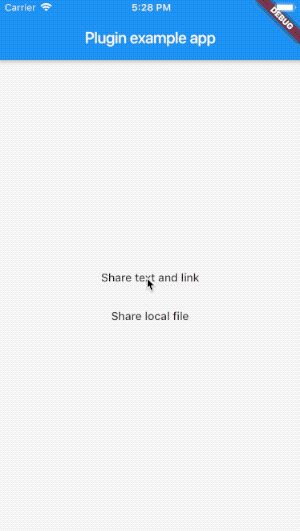

# Share Plugin

[](https://pub.dartlang.org/packages/flutter_share)

A Flutter plugin for IOS and Android providing a simple way to share a message, link or local files.

## Features:

* Share message and/or link urls.
* Share local file path

 ........... 

## Installation

First, add `flutter_share` as a [dependency in your pubspec.yaml file](https://flutter.io/using-packages/).

### iOS

Add if not exists one row to the `ios/podfile` after target runner:

```
...

target 'Runner' do
    use_frameworks!

...
```

### Example

Here is an example flutter app displaying the two shares methods. (I'm using documents_picker just to get a local file you don't need to use.)

```dart
import 'package:flutter/material.dart';
import 'dart:async';

import 'package:flutter/services.dart';
import 'package:flutter_share/flutter_share.dart';
import 'package:documents_picker/documents_picker.dart';

void main() => runApp(MyApp());

class MyApp extends StatelessWidget {
  Future<void> share() async {
    await FlutterShare.share(
      title: 'Example share',
      text: 'Example share text',
      linkUrl: 'https://flutter.dev/',
      chooserTitle: 'Example Chooser Title'
    );
  }

  Future<void> shareFile() async {
    List<dynamic> docs = await DocumentsPicker.pickDocuments;
    if (docs == null || docs.isEmpty) return null;

    await FlutterShare.shareFile(
      title: 'Example share',
      text: 'Example share text',
      filePath: docs[0] as String,
    );
  }

  @override
  Widget build(BuildContext context) {
    return MaterialApp(
      home: Scaffold(
        appBar: AppBar(
          title: const Text('Plugin example app'),
        ),
        body: Center(
          child: Column(
            crossAxisAlignment: CrossAxisAlignment.center,
            mainAxisAlignment: MainAxisAlignment.center,
            children: <Widget>[
              FlatButton(
                child: Text('Share text and link'),
                onPressed: share,
              ),
              FlatButton(
                child: Text('Share local file'),
                onPressed: shareFile,
              ),
            ],
          ),
        ),
      ),
    );
  }
}
```

[Feedback welcome](https://github.com/flutter/flutter/issues) and
[Pull Requests](https://github.com/flutter/plugins/pulls) are most welcome!
